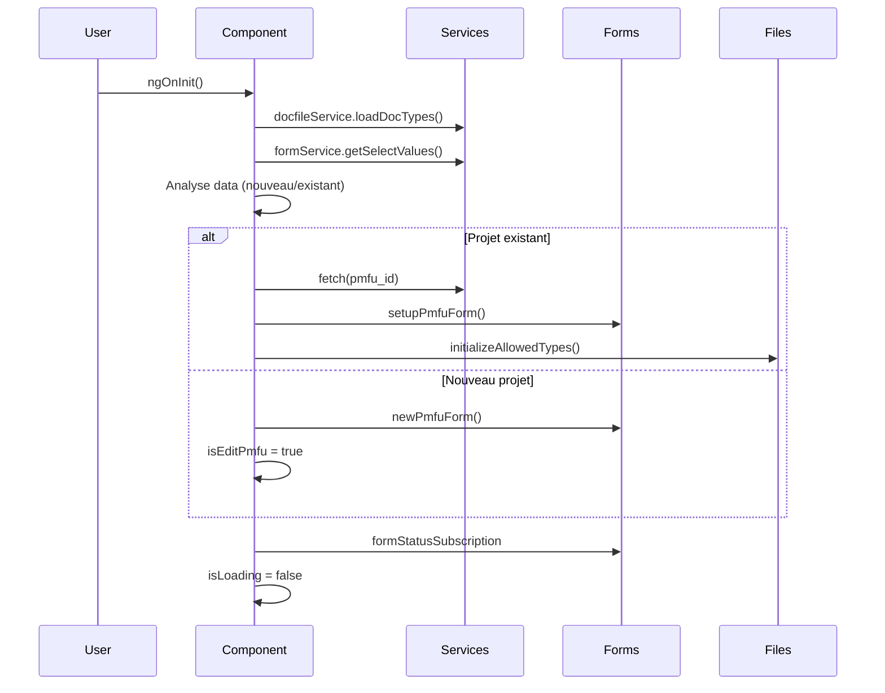
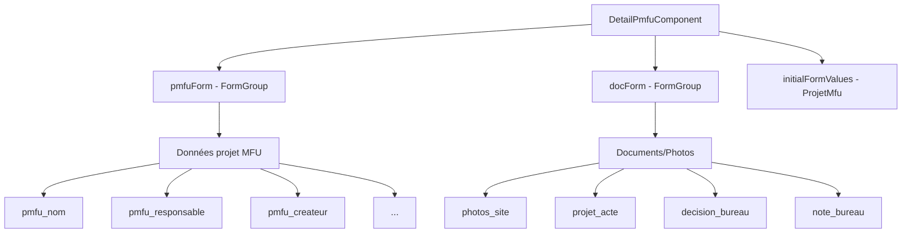
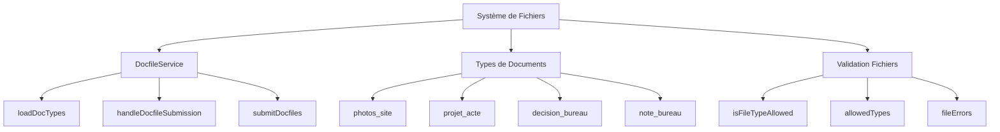
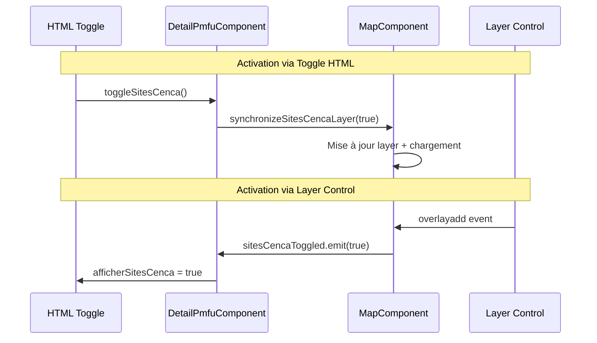
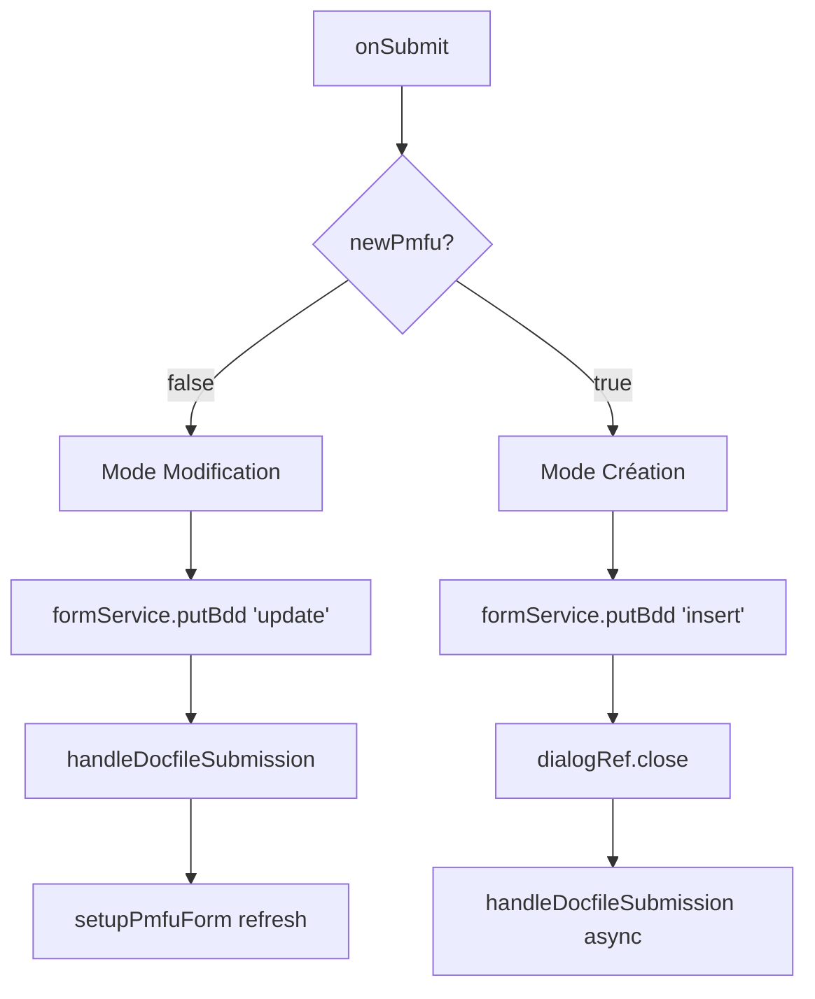

# 📋 DetailPmfuComponent - Architecture et Documentation Complète

## 📋 Vue d'ensemble

Le `DetailPmfuComponent` est un composant de dialogue complexe pour la gestion des projets MFU (Maîtrise Foncière et d'Usage). Il combine la gestion de formulaires, l'upload de documents, la visualisation cartographique et la gestion d'états multiples.

**Statistiques du composant :**
- **Lignes de code :** ~770 lignes
- **Imports :** 25+ modules Angular Material
- **Méthodes publiques :** 15
- **Méthodes privées :** 4
- **ViewChild :** 4 composants enfants
- **Modes de fonctionnement :** 3 (Consultation, Édition, Création)
- **Types de fichiers gérés :** Documents + Images

---

## 🏗️ Architecture Générale

```mermaid
graph TB
    subgraph "INPUTS"
        I1[MAT_DIALOG_DATA]
        I2[ProjetsMfu | number]
    end

    subgraph "CORE COMPONENT"
        DC[DetailPmfuComponent]
    end

    subgraph "CHILD COMPONENTS"
        MAP[MapComponent]
        FILE[FileExploratorComponent]
        FORM[FormButtonsComponent]
    end

    subgraph "SERVICES"
        FS[FoncierService]
        FORM_S[FormService]
        DOC[DocfileService]
        LOGIN[LoginService]
        CONF[ConfirmationService]
    end

    subgraph "STATES"
        LOADING[isLoading]
        EDIT[isEditPmfu]
        NEW[newPmfu]
        VALID[isFormValid]
    end

    I1 --> DC
    I2 --> DC
    DC --> MAP
    DC --> FILE
    DC --> FORM
    DC --> FS
    DC --> FORM_S
    DC --> DOC
    DC --> LOGIN
    DC --> CONF
    DC --> LOADING
    DC --> EDIT
    DC --> NEW
    DC --> VALID
```

---

## 🔄 Cycle de Vie du Composant

### 1. Initialisation Complète



### 2. Chaînage d'Initialisation

```
ngOnInit()
├── docfileService.loadDocTypes(1)
├── formService.getSelectValues$('salaries')
├── Analyse this.projetLite
│
├── SI PROJET EXISTANT:
│   ├── setTimeout(loadingDelay)
│   ├── setupPmfuForm()
│   │   ├── fetch(pmfu_id)
│   │   ├── updatePmfuTitle()
│   │   ├── formService.newPmfuForm(pmfu)
│   │   ├── docForm = newDocForm(pmfu)
│   │   └── foldersSubject.next(newFolders)
│   └── formStatusSubscription
│
└── SI NOUVEAU PROJET:
    ├── newPmfu = true
    ├── isEditPmfu = true
    ├── pmfuForm = newPmfuForm(undefined, 0)
    ├── docForm = newDocForm()
    ├── patchValue(responsable, createur)
    └── formStatusSubscription
```

---

## 📝 Système de Formulaires

### Architecture des Formulaires



### États du Formulaire

| État | Description | Déclencheur |
|------|-------------|-------------|
| `isFormValid` | Validité du formulaire principal | `formStatusSubscription` |
| `isEditPmfu` | Mode édition activé | `toggleEditPmfu()` |
| `newPmfu` | Création nouveau projet | Constructeur |
| `isLoading` | Chargement en cours | Async operations |

---

## 📂 Système de Gestion de Fichiers

### Architecture des Documents



### Chaînage Upload de Fichiers

```
onFileSelected() / onFileDropped()
    ├── isFileTypeAllowed(file, field)
    │   ├── Vérification allowedTypes[field]
    │   ├── Extension autorisée ?
    │   └── Ajout fileErrors si refus
    │
    ├── docfileService.onFileSelected()
    ├── filesNames.push([fileName, controlName])
    │
    └── onSubmit()
        └── docfileService.handleDocfileSubmission()
            ├── Upload vers serveur
            ├── Mise à jour base de données
            └── fileExplorator.updateFolderCounts()
```

### Types de Fichiers Supportés

```typescript
defaultExtensions = {
  doc: ['.pdf', '.doc', '.docx'],    // Documents
  image: ['.jpg', '.jpeg', '.png']   // Images
}

// Auto-détection basée sur le nom du champ :
// Si contient "photo" ou "image" → type image
// Sinon → type document
```

---

## 🗺️ Intégration Cartographique

### Synchronisation Parcelles (carte ↔ formulaire)

Le flux de parcelles sélectionnées est désormais **synchronisé explicitement** avec le `FormGroup` avant la sauvegarde, afin d'assurer que l’update backend se déclenche même si seul le Step 2 (carte) change.

Points clés :

- **Synchronisation systématique** via `syncParcellesToForm()` à chaque sélection.
- **Synchronisation forcée avant sauvegarde** dans `onSubmit()`.
- **Détection de changement fiable** côté service via `getRawValue()`.

```typescript
// Avant l’appel à putBdd()
this.syncParcellesToForm(this.parcellesSelected);
```

```typescript
private syncParcellesToForm(parcelles: ParcellesSelected[]): void {
    if (!this.pmfuForm) return;
    const ids = parcelles.map(p => p.idu);
    this.pmfuForm.patchValue({ pmfu_parc_list_array: ids });
    this.pmfuForm.get('pmfu_parc_list_array')?.markAsDirty();
    this.pmfuForm.get('pmfu_parc_list_array')?.updateValueAndValidity({ emitEvent: false });
}
```

### Synchronisation Map ↔ Toggles



### Variables Cartographiques

```typescript
// État des couches CENCA
afficherSitesCenca: boolean = false;        // Couche colorée
afficherSitesCencaSites: boolean = false;   // Couche verte

// Gestionnaires de synchronisation
onSitesCencaToggled(active: boolean)        // ← MapComponent
onSitesCencaSitesToggled(active: boolean)   // ← MapComponent

// Actions utilisateur
toggleSitesCenca()                          // → MapComponent
toggleSitesCencaSites()                     // → MapComponent
```

---

## 💾 Gestion des Données

### Flux de Sauvegarde



### API Endpoints

| Action | Route | Méthode | Paramètres |
|--------|-------|---------|------------|
| Récupération | `pmfu/id=${pmfu_id}/full` | GET | pmfu_id |
| Création | `projets_mfu` | POST | FormData |
| Modification | `projets_mfu` | PUT | pmfu_id + FormData |
| Suppression | `pmfu/${pmfu_id}` | DELETE | pmfu_id |

---

## 🎛️ Modes de Fonctionnement

### 1. Mode Consultation (Défaut)

```typescript
isEditPmfu = false
newPmfu = false
// → Formulaires désactivés
// → Boutons "Éditer" et "Supprimer" visibles
// → Carte et fichiers en lecture seule
```

### 2. Mode Édition

```typescript
isEditPmfu = true
newPmfu = false
// → Formulaires activés
// → Boutons "Sauvegarder" et "Annuler"
// → Upload de fichiers possible
// → Intégration carte complète
```

### 3. Mode Création

```typescript
isEditPmfu = true
newPmfu = true
// → Formulaire vide pré-rempli
// → Responsable = utilisateur connecté
// → Sauvegarde → Fermeture dialogue
// → Upload différé après création
```

---

## 📊 Services et Dépendances

### Services Principaux

| Service | Rôle | Méthodes Utilisées |
|---------|------|-------------------|
| `FoncierService` | API PMFU | getProjetMfu(), deletePmfu() |
| `FormService` | Gestion formulaires | newPmfuForm(), putBdd(), getSelectValues$() |
| `DocfileService` | Gestion fichiers | loadDocTypes(), handleDocfileSubmission() |
| `LoginService` | Authentification | user() |
| `ConfirmationService` | Dialogues | confirm() |

### Composants Enfants

```typescript
@ViewChild(MapComponent) mapComponent!;
@ViewChild(FileExploratorComponent) fileExplorator!;
@ViewChild('fileInput') fileInput!: ElementRef;
@ViewChild('docxContainer') docxContainer!: ElementRef;
```

---

## 🔄 Gestion d'États Complexes

### Variables d'État Critiques

```typescript
// États principaux
isLoading: boolean = true;              // Chargement initial
isEditPmfu: boolean = false;            // Mode édition
newPmfu: boolean = false;               // Nouveau projet
isFormValid: boolean = false;           // Validité formulaire

// États de fichiers
isDragging: boolean = false;            // Drag & drop actif
filesNames: string[][] = [];           // Fichiers sélectionnés
fileErrors: Record<string, string[]>;   // Erreurs par champ

// États de documents
folders: Section[] = [];                // Dossiers avec compteurs
selectedFolder?: number;                // Dossier sélectionné
galerie?: string[];                     // Images en galerie
```

### Observables et Subscriptions

```typescript
// Réactivité formulaire
formStatusSubscription: Subscription
formService.statusChanges.subscribe()

// Données de sélection
formService.getSelectValues$('salaries')
salaries: SelectValue[]

// Gestion des dossiers
foldersSubject = BehaviorSubject<Section[]>([])
folders$ = foldersSubject.asObservable()
```

---

## 🎨 Interface Utilisateur

### Composants Material Utilisés

- **Navigation :** MatStepper avec orientation responsive
- **Formulaires :** MatInput, MatSelect, MatDatepicker, MatSlideToggle
- **Actions :** MatButton, MatIcon
- **Affichage :** MatList, MatProgressSpinner
- **Dialogue :** MatDialog avec backdrop personnalisé

### Responsive Design

```typescript
// Détection mobile/desktop
private breakpointObserver: BreakpointObserver
StepperOrientation // Adaptatif selon écran
```

---

## 🔧 Fonctions Utilitaires et Helpers

### Gestion des Fichiers

```typescript
// Validation type fichier
isFileTypeAllowed(file: File, field: string): boolean
├── Vérification allowedTypes[field]
├── Extension dans liste autorisée ?
└── Gestion fileErrors[field]

// Initialisation types autorisés
initializeAllowedTypes(): void
├── Analyse doc_types
├── Détection image vs document
└── Mapping vers defaultExtensions

// Suppression fichier
removeDroppedFile(fileToRemove: [string, string])
├── Mise à jour filesNames
├── Mise à jour FormControl
└── updateValueAndValidity()
```

### Gestion du Formulaire

```typescript
// Basculement mode édition
toggleEditPmfu(): void
├── formService.simpleToggle(isEditPmfu)
├── formService.toggleFormState()
├── Gestion formStatusSubscription
└── cdr.detectChanges()

// Configuration formulaire projet
setupPmfuForm(): Promise<void>
├── fetch(pmfu_id) → ProjetMfu
├── updatePmfuTitle()
├── newPmfuForm(pmfu) + newDocForm(pmfu)
├── Mapping doc_types → folders
└── foldersSubject.next(newFolders)
```

---

## 🚨 Gestion d'Erreurs et Validation

### Stratégies d'Erreurs

```typescript
// Erreurs de fichiers
fileErrors: Record<string, string[]>
├── Validation en temps réel
├── Affichage temporaire (3s)
└── Nettoyage automatique

// Erreurs réseau
HTTP Error → FormService.putBdd()
├── MatSnackBar notification
├── Gestion success/failure
└── Rollback automatique si échec

// Erreurs de validation
formStatusSubscription
├── isFormValid en temps réel
├── Désactivation boutons si invalide
└── Feedback visuel immediate
```

### Points de Validation

1. **Formulaire principal :** Validation Angular reactive
2. **Types de fichiers :** Extension + taille
3. **Authentification :** Utilisateur connecté requis
4. **Données obligatoires :** Nom projet, responsable
5. **Suppression :** Confirmation utilisateur

---

## ⚡ Optimisations et Performance

### Optimisations Implémentées

```typescript
// Délai de chargement artificiel
loadingDelay: number = 400;
setTimeout(async () => { /* setup */ }, loadingDelay);

// Change Detection
cdr.detectChanges() // Force le rendu
setTimeout(() => this.cdr.detectChanges(), 0); // Async

// Observables cleanup
formStatusSubscription?.unsubscribe()

// Lazy loading
if (this.fileExplorator) {
  this.fileExplorator.updateFolderCounts();
}
```

### Gestion Mémoire

- **Subscriptions :** Nettoyage explicite des souscriptions
- **ViewChild :** Vérification existence avant utilisation
- **Timeout :** Gestion des délais et cleanup
- **Change Detection :** Optimisé avec OnPush quand possible

---

## 🎯 Points d'Extension

### Ajouter un Nouveau Type de Document

1. **Backend :** Ajouter dans table doc_types
2. **Interface :** Étendre Section interface si besoin
3. **Formulaire :** Auto-détection via initializeAllowedTypes()
4. **Upload :** handleDocfileSubmission() gère automatiquement

### Ajouter une Nouvelle Validation

```typescript
// Dans isFileTypeAllowed()
const maxSize = 10 * 1024 * 1024; // 10MB
if (file.size > maxSize) {
  this.fileErrors[field].push('Fichier trop volumineux');
  return false;
}
```

### Intégrer un Nouveau Service

```typescript
constructor(
  // ... services existants
  private nouveauService: NouveauService
) {}

// Utilisation dans ngOnInit() ou autres méthodes
```

---

## 📋 Configuration et Constantes

### Configuration Dialogue

```typescript
dialogConfig = {
  width: '580px',
  height: '220px',
  hasBackdrop: true,
  backdropClass: 'custom-backdrop-delete',
  enterAnimationDuration: '3000ms',
  exitAnimationDuration: '300ms',
};
```

### Extensions Autorisées

```typescript
defaultExtensions: Record<string, string[]> = {
  doc: ['.pdf', '.doc', '.docx'],
  image: ['.jpg', '.jpeg', '.png']
};
```

---

## 🔧 Maintenance et Debug

### Points de Debug Critiques

```typescript
// États à surveiller
console.log('isEditPmfu:', this.isEditPmfu);
console.log('newPmfu:', this.newPmfu);
console.log('isFormValid:', this.isFormValid);
console.log('isLoading:', this.isLoading);

// Données formulaire
console.log('pmfuForm.value:', this.pmfuForm.value);
console.log('docForm.value:', this.docForm.value);

// Fichiers
console.log('filesNames:', this.filesNames);
console.log('fileErrors:', this.fileErrors);
console.log('allowedTypes:', this.allowedTypes);

// Synchronisation carte
console.log('afficherSitesCenca:', this.afficherSitesCenca);
console.log('mapComponent exists:', !!this.mapComponent);
```

### Problèmes Courants

1. **Formulaire invalide :** Vérifier formStatusSubscription
2. **Fichiers refusés :** Contrôler allowedTypes et extensions
3. **Carte non synchronisée :** Vérifier ViewChild MapComponent
4. **Upload échoué :** Examiner handleDocfileSubmission logs
5. **Données manquantes :** Vérifier fetch() et setupPmfuForm()

---

## 📈 Métriques et Statistiques

**Complexité du Composant :**
- 🎯 **Complexité :** Très élevée (770+ lignes, multiples responsabilités)
- 🔄 **États gérés :** 15+ variables d'état
- 📝 **Formulaires :** 2 FormGroup principaux + validation
- 📂 **Types fichiers :** 4 types documents + validation
- 🗺️ **Intégration carte :** Synchronisation bidirectionnelle
- ⚡ **Performance :** Optimisée (lazy loading, change detection)
- 🔗 **Couplage :** Modéré (5 services + 4 ViewChild)

**Patterns Utilisés :**
- Observer Pattern (formStatusSubscription)
- Strategy Pattern (allowedTypes)
- Factory Pattern (FormService)
- Command Pattern (onSubmit actions)
- Template Method (setupPmfuForm)

---

*Documentation générée le 17 octobre 2025*
*DetailPmfuComponent v1.0 - Composant de gestion projet MFU complet*