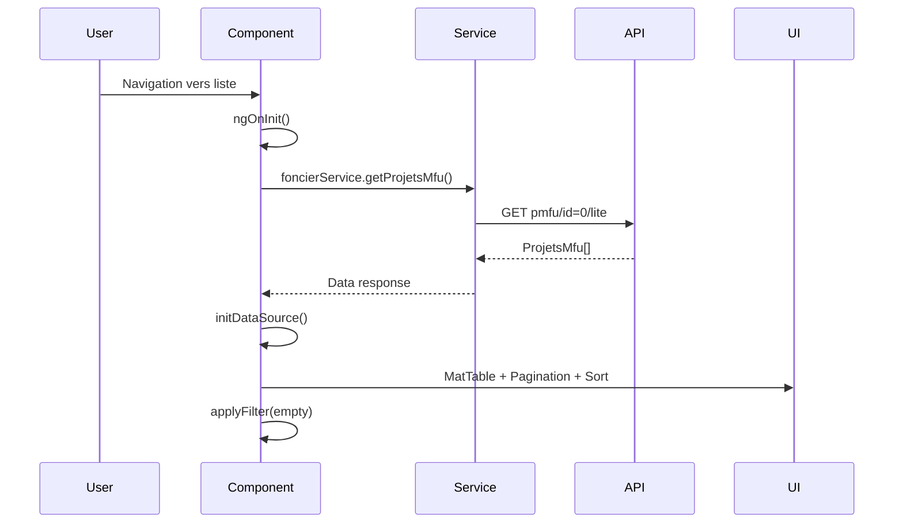
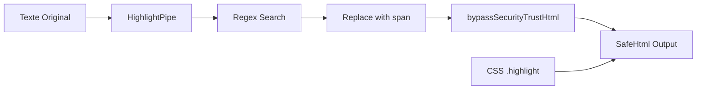
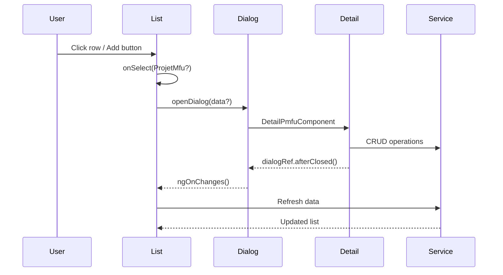

# 📋 FonPmfuComponent - Architecture et Documentation Complète

## 📋 Vue d'ensemble

Le `FonPmfuComponent` est le composant parent de gestion des projets MFU (Maîtrise Foncière et d'Usage). Il fournit une interface de liste avec recherche, tri, pagination et ouverture de dialogues pour la gestion détaillée des projets.

**Statistiques du composant :**
- **Lignes de code :** ~230 lignes
- **Rôle :** Composant liste/tableau (CRUD parent)
- **Enfant principal :** DetailPmfuComponent (dialogue)
- **Fonctionnalités :** Liste, recherche, tri, pagination, CRUD
- **Type :** Container/Smart Component
- **Complexité :** Modérée (liste avec gestion d'état)

---

## 🏗️ Architecture Générale

```mermaid
graph TB
    subgraph "PARENT COMPONENT"
        FPC[FonPmfuComponent]
    end

    subgraph "DATA LAYER"
        FS[FoncierService]
        API[API Backend]
        DATA[ProjetsMfu[]]
    end

    subgraph "UI COMPONENTS"
        TABLE[MatTable]
        SEARCH[MatInput Search]
        SORT[MatSort]
        PAG[MatPaginator]
    end

    subgraph "CHILD DIALOG"
        DETAIL[DetailPmfuComponent]
    end

    FPC --> FS
    FS --> API
    API --> DATA
    DATA --> TABLE
    FPC --> SEARCH
    FPC --> SORT
    FPC --> PAG
    FPC --> DETAIL
```

---

## 🔄 Cycle de Vie du Composant

### 1. Initialisation et Chargement des Données



### 2. Chaînage d'Initialisation

```
ngOnInit()
├── foncierService.getProjetsMfu('pmfu/id=0/lite')
├── this.pmfuLite = data
├── initDataSource(this.pmfuLite)
│   ├── new MatTableDataSource(data)
│   ├── Attach sort + paginator
│   ├── Configure sortingDataAccessor
│   └── Apply existing filter if any
└── applyFilter(fakeEvent) // Filtrage initial vide
```

---

## 📊 Système de Tableau MatTable

### Architecture des Données

```mermaid
graph TD
    A[API Response] --> B[ProjetsMfu[]]
    B --> C[MatTableDataSource]
    C --> D[MatTable]
    
    C --> E[Filtrage]
    C --> F[Tri]
    C --> G[Pagination]
    
    E --> H[cleanString() + toLowerCase()]
    F --> I[sortingDataAccessor]
    G --> J[MatPaginator]
    
    D --> K[displayedColumns]
    K --> L['pmfu_nom']
    K --> M['pmfu_responsable'] 
    K --> N['pmfu_commune']
```

### Configuration du Tableau

```typescript
// Colonnes affichées
displayedColumns = ['pmfu_nom', 'pmfu_responsable', 'pmfu_commune']

// Source de données réactive
dataSource: MatTableDataSource<ProjetsMfu>

// ViewChild pour contrôles
@ViewChild(MatPaginator) paginator!: MatPaginator;
@ViewChild(MatSort) sort!: MatSort;
```

---

## 🔍 Système de Recherche et Filtrage

### Chaînage du Filtrage

```mermaid
graph TD
    A[User Input] --> B[applyFilter Event]
    B --> C[Extract Value]
    C --> D[filterValue.trim().toLowerCase()]
    D --> E[dataSource.filter = filterValue]
    E --> F[AutoFilter sur colonnes]
    F --> G[paginator.firstPage()]
    
    G --> H[Résultats Filtrés]
```

### Logique de Nettoyage des Chaînes

```typescript
cleanString(str: string): string {
  return str.replace(/\s+/g, ' ')  // Espaces multiples → simple
    .trim()                        // Suppression bordures
    .toLowerCase();                // Normalisation casse
}

// Utilisé dans sortingDataAccessor pour tri cohérent
```

---

## 🎨 Pipe de Mise en Évidence (HighlightPipe)

### Architecture du Pipe Personnalisé



### Implémentation

```typescript
@Pipe({ name: 'highlight', standalone: true })
export class HighlightPipe implements PipeTransform {
  transform(value: string, search: string): SafeHtml {
    if (!value) return '';
    if (!search) return value;
    
    const regex = new RegExp(`(${search})`, 'gi');
    const result = value.replace(regex, `<span class="highlight">$1</span>`);
    return this.sanitizer.bypassSecurityTrustHtml(result);
  }
}
```

---

## 🏠 Gestion des Dialogues

### Workflow d'Ouverture des Dialogues



### Configuration des Dialogues

```typescript
// Projet existant - Mode consultation/édition
const dialogRef = this.dialog.open(DetailPmfuComponent, {
  data: ProjetMfu,              // Données projet
  width: '90vw',                // Large pour édition
  height: '85vh',
  hasBackdrop: true,
  backdropClass: 'custom-backdrop-gerer',
  enterAnimationDuration: '400ms',
  exitAnimationDuration: '300ms',
  scrollStrategy: this.overlay.scrollStrategies.close()
});

// Nouveau projet - Mode création
const dialogRef = this.dialog.open(DetailPmfuComponent, {
  data: '',                     // Pas de données → nouveau
  minWidth: '50vw',             // Plus compact pour création
  maxWidth: '95vw',
  height: '70vh',
  maxHeight: '90vh',
  // ... autres options identiques
});
```

---

## 🔄 Gestion des États et Modes

### Variables d'État

```typescript
// États d'interface
public isAddPmfu: boolean = false;      // Mode ajout activé
public isEditPmfu: boolean = false;     // Mode édition activé  
public filterValue: string = '';        // Valeur de recherche

// Données
pmfuLite!: ProjetsMfu[];                // Liste projets (lite)
pmfu?: ProjetMfu;                       // Projet détaillé
dataSource!: MatTableDataSource<ProjetsMfu>; // Source tableau

// Formulaires (partiellement implémentés)
pmfuForm!: FormGroup;                   // Formulaire principal
initialFormValues!: FormGroup;         // Valeurs initiales
```

### Méthodes de Gestion d'États

```typescript
// Basculement modes (partiellement implémenté)
toggleEditPmfu(mode: string): void
├── 'edit' → Toggle isEditPmfu
├── 'add' → Toggle isAddPmfu + makePmfuForm()
└── autres → Reset modes

// Création formulaire (stub)
makePmfuForm({ pmfu?, empty? }): Promise<void>
└── // TODO: Implémentation formulaire inline

// Soumission (stub)  
onSubmit(mode?: String): void
└── // TODO: Logique sauvegarde inline
```

---

## 📱 Interface Utilisateur et Responsive

### Composants Material Utilisés

```typescript
// Tableau et données
MatTableModule,        // Tableau principal
MatSortModule,         // Tri colonnes
MatPaginatorModule,    // Pagination

// Interface utilisateur
MatInputModule,        // Champ recherche
MatIconModule,         // Icônes actions
MatButtonModule,       // Boutons actions
MatTooltipModule,      // Info-bulles
MatFormFieldModule,    // Champs formulaire

// Dialogue
MatDialogModule        // Dialogues modaux
```

### Configuration Pagination Personnalisée

```typescript
providers: [
  { provide: MatPaginatorIntl, useClass: CustomMatPaginatorIntl }
]
// → Labels pagination en français
```

---

## 🔧 Méthodes et Fonctionnalités

### Méthodes Principales

| Méthode | Rôle | Statut | Complexité |
|---------|------|--------|------------|
| `ngOnInit()` | Initialisation + chargement données | ✅ Complet | Faible |
| `ngAfterViewInit()` | Attach ViewChild (sort/paginator) | ✅ Complet | Faible |
| `ngOnChanges()` | Rechargement données | ✅ Complet | Faible |
| `onSelect()` | Sélection ligne + ouverture dialogue | ✅ Complet | Faible |
| `openDialog()` | Configuration et ouverture dialogue | ✅ Complet | Modérée |
| `applyFilter()` | Filtrage tableau | ✅ Complet | Faible |
| `initDataSource()` | Configuration MatTableDataSource | ✅ Complet | Modérée |
| `cleanString()` | Normalisation chaînes pour tri | ✅ Complet | Faible |
| `toggleEditPmfu()` | Gestion modes (inline) | ⚠️ Stub | Faible |
| `makePmfuForm()` | Création formulaire inline | ⚠️ Stub | Moyenne |
| `onSubmit()` | Soumission formulaire inline | ⚠️ Stub | Moyenne |

### Fonctionnalités Implémentées vs En Attente

```
✅ IMPLÉMENTÉ:
├── Liste avec pagination/tri/recherche
├── Ouverture dialogues (consultation/édition/création)
├── Rechargement automatique après modifications
├── Highlight des résultats de recherche
├── Gestion responsive des dialogues
└── Navigation fluide avec animations

⚠️ STUBS/TODO:
├── Édition inline dans le tableau
├── Ajout inline dans le tableau  
├── Formulaires inline (alternatives aux dialogues)
└── Validation et soumission inline
```

---

## 🔄 Flux de Données et Communication

### Communication Parent → Enfant (Dialogue)

```mermaid
graph LR
    A[FonPmfuComponent] --> B[MatDialog.open]
    B --> C[DetailPmfuComponent]
    C --> D[MAT_DIALOG_DATA]
    
    E[ProjetsMfu | ''] --> D
    F[Dialog Config] --> B
```

### Communication Enfant → Parent (Callbacks)

```mermaid
graph RL
    A[DetailPmfuComponent] --> B[dialogRef.close()]
    B --> C[afterClosed().subscribe()]
    C --> D[ngOnChanges({})]
    D --> E[Refresh Data]
    E --> F[initDataSource()]
```

---

## ⚡ Optimisations et Performance

### Optimisations Implémentées

```typescript
// Change Detection manuelle
this.cdr.detectChanges();

// Async data loading avec async/await
async ngOnInit() { /* ... */ }
async ngOnChanges() { /* ... */ }

// Délai pour attachement ViewChild
setTimeout(() => {
  this.dataSource.filter = this.filterValue;
  if (this.dataSource.paginator) this.dataSource.paginator.firstPage();
}, 0);

// Scroll strategy optimisée pour dialogues
scrollStrategy: this.overlay.scrollStrategies.close()
```

### Points d'Amélioration Potentiels

```typescript
// 1. Gestion des subscriptions
private destroy$ = new Subject<void>();

// 2. Pagination côté serveur
// Au lieu de charger toutes les données

// 3. Lazy loading des dialogues
// Import dynamique des composants

// 4. Virtual scrolling pour grandes listes
// MatTableDataSource → CDK Virtual Scroll

// 5. Debounce sur la recherche
// Éviter requêtes multiples pendant frappe
```

---

## 🎯 API et Endpoints

### Routes Utilisées

| Endpoint | Méthode | Paramètres | Réponse | Usage |
|----------|---------|------------|---------|-------|
| `pmfu/id=0/lite` | GET | id=0 (tous) | ProjetsMfu[] | Liste initiale |
| `pmfu/id=0/lite` | GET | id=0 (tous) | ProjetsMfu[] | Rechargement |

### Structure des Données

```typescript
// ProjetsMfu (Version allégée pour liste)
interface ProjetsMfu {
  pmfu_id?: number;           // ID unique
  pmfu_nom?: string;          // Nom projet  
  pmfu_responsable?: string;  // Responsable
  pmfu_commune?: string;      // Commune
  // ... autres champs allégés
}

// ProjetMfu (Version complète pour détail)
interface ProjetMfu extends ProjetsMfu {
  // Tous les champs détaillés...
  // Géré dans DetailPmfuComponent
}
```

---

## 🔧 Configuration et Personnalisation

### Configuration MatTable

```typescript
// Tri personnalisé avec nettoyage des chaînes
sortingDataAccessor = (item, property) => {
  switch (property) {
    case 'pmfu_nom':
      return item.pmfu_nom ? this.cleanString(item.pmfu_nom) : 'zzzzzz';
    case 'pmfu_responsable':
      return item.pmfu_responsable ? item.pmfu_responsable.toLowerCase() : '';
    case 'pmfu_commune':
      return item.pmfu_commune ? item.pmfu_commune.toLowerCase() : '';
    default:
      return '';
  }
};
```

### Configuration Dialogues

```typescript
// Thèmes et animations personnalisés
backdropClass: 'custom-backdrop-gerer'
enterAnimationDuration: '400ms'
exitAnimationDuration: '300ms'

// Stratégie de scroll pour éviter décalages
scrollStrategy: this.overlay.scrollStrategies.close()
```

---

## 🚨 Gestion d'Erreurs

### Stratégies d'Erreurs Implémentées

```typescript
// Gestion d'erreur dans ngOnChanges
try {
  const data = await this.foncierService.getProjetsMfu(subroute);
  this.pmfuLite = data;
  this.initDataSource(this.pmfuLite);
} catch (error) {
  console.error('Error fetching documents', error);
  // TODO: Gestion d'erreur utilisateur (snackbar, etc.)
}
```

### Points d'Amélioration Gestion d'Erreurs

```typescript
// 1. Gestion d'erreurs plus robuste
catch (error) {
  this.errorService.handleError(error);
  this.snackBar.open('Erreur de chargement', 'Fermer');
}

// 2. États de chargement
isLoading: boolean = false;

// 3. Retry automatique
retry(3) // Dans l'observable

// 4. Fallback data
this.pmfuLite = this.pmfuLite || []; // Garde ancienne data si erreur
```

---

## 📋 Patterns de Conception Utilisés

### Container/Presentational Pattern

```
FonPmfuComponent (Smart/Container)
├── Gestion des données (FoncierService)
├── Gestion d'état (isAddPmfu, isEditPmfu)
├── Communication avec API
└── Orchestration des dialogues

DetailPmfuComponent (Presentational/Dumb)
├── Affichage et édition détaillée
├── Logique formulaire
├── Upload fichiers
└── Communication via @Input/@Output
```

### Observer Pattern

```typescript
// Dialogues avec callbacks
dialogRef.afterClosed().subscribe((result) => {
  this.ngOnChanges({}); // Refresh automatique
});
```

### Factory Pattern (Partiel)

```typescript
// Configuration dynamique des dialogues
openDialog(ProjetMfu?: ProjetMfu): void {
  const config = ProjetMfu ? existingProjectConfig : newProjectConfig;
  const dialogRef = this.dialog.open(DetailPmfuComponent, config);
}
```

---

## 🔧 Maintenance et Debug

### Points de Debug Critiques

```typescript
// États à surveiller
console.log('pmfuLite:', this.pmfuLite);
console.log('dataSource:', this.dataSource);
console.log('filterValue:', this.filterValue);
console.log('isAddPmfu:', this.isAddPmfu);
console.log('isEditPmfu:', this.isEditPmfu);

// ViewChild attachments
console.log('paginator attached:', !!this.paginator);
console.log('sort attached:', !!this.sort);

// Données de service
console.log('API response:', data);
console.log('Service status:', this.foncierService);
```

### Problèmes Courants et Solutions

1. **Tableau vide** : Vérifier API response et initDataSource()
2. **Tri/Pagination non fonctionnel** : Contrôler ngAfterViewInit
3. **Recherche inefficace** : Examiner cleanString() et sortingDataAccessor
4. **Dialogue ne s'ouvre pas** : Vérifier configuration et data passée
5. **Pas de refresh après modifications** : Contrôler afterClosed() subscription

---

## 📈 Métriques et Évaluation

**Complexité du Composant :**
- 🎯 **Complexité :** Modérée (230 lignes, responsabilité claire)
- 📊 **Type :** Container/Smart Component
- 🔄 **États gérés :** 5 variables principales
- 📱 **UI :** MatTable + Pagination + Search + Dialogues
- ⚡ **Performance :** Correcte (async loading, optimisations de base)
- 🔗 **Couplage :** Faible (1 service principal)

**Patterns et Bonnes Pratiques :**
- ✅ Séparation Container/Presentational
- ✅ Async/await pour les appels API
- ✅ ViewChild pour contrôles Material
- ✅ Change detection manuelle quand nécessaire
- ✅ Configuration réutilisable des dialogues

**Points d'Extension :**
- Édition inline (stubs présents)
- Pagination côté serveur
- Recherche avancée/filtres multiples
- Export de données
- Actions en lot

---

## 🚀 Comparaison avec DetailPmfuComponent

| Aspect | FonPmfuComponent | DetailPmfuComponent |
|--------|------------------|---------------------|
| **Complexité** | Modérée (230 lignes) | Très élevée (770 lignes) |
| **Responsabilité** | Liste/Navigation | Édition/CRUD complet |
| **États** | 5 variables simples | 15+ variables complexes |
| **Formulaires** | Stubs (inline future) | 2 FormGroup complets |
| **Fichiers** | Aucun | Upload/validation avancée |
| **Carte** | Aucune | Intégration bidirectionnelle |
| **Services** | 1 principal | 5+ services |
| **Enfants** | 1 dialogue | 4 ViewChild |

**Conclusion :** Le composant parent est bien conçu pour son rôle de liste/navigation. Il est simple, efficace et maintenable. Les stubs préparent l'extension future vers l'édition inline.

---

*Documentation générée le 17 octobre 2025*
*FonPmfuComponent v1.0 - Composant liste projets MFU*